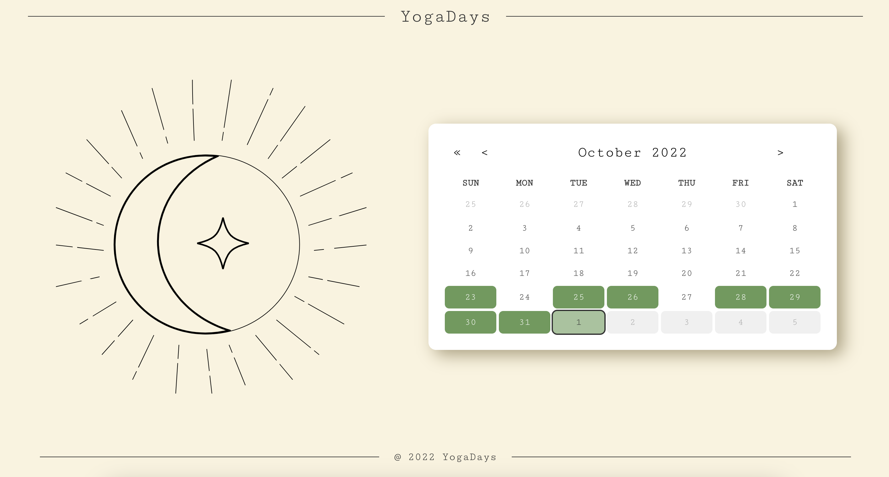

# YogaDays

Welcome to YogaDays, a simple way to track the progress of your yoga journey without the need for a complicated app or a paid subscription!

<a href="https://yogadays.netlify.app" target="_blank">🧘‍♀️ Check it out here!</a>

---

_YogaDays Home Screen_

---

# Features

**-Clicking on any day on the calendar will bring users to a page with a randomly selected video from a list of videos.**

**-Completing the video will mark the page as complete**

**-The calendar days that have been completed will be marked with a green color on the calendar**

_Multiple days completed_

---

# Other Features:

**-Each page, with their corresponding video and completion status, will be saved in the browser and will read from storage when the page loads**

---

## Technologies Used:

React

React Router

Styled Components

Javascript

CSS

Figma

---
